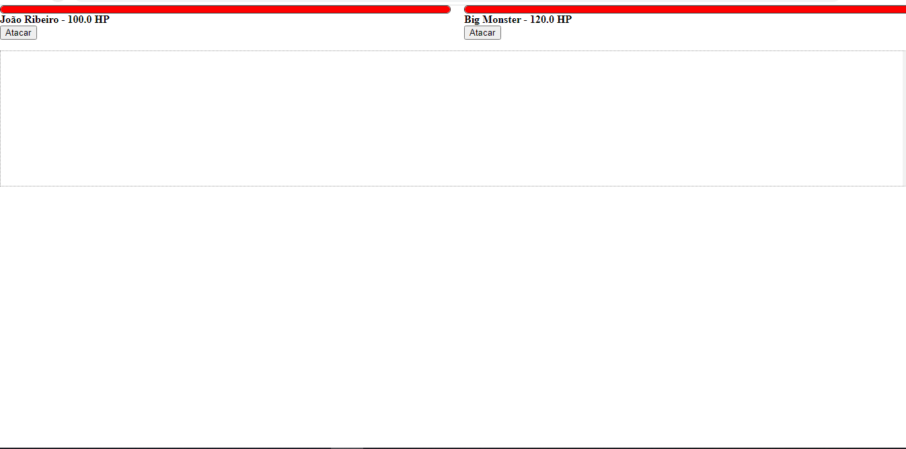
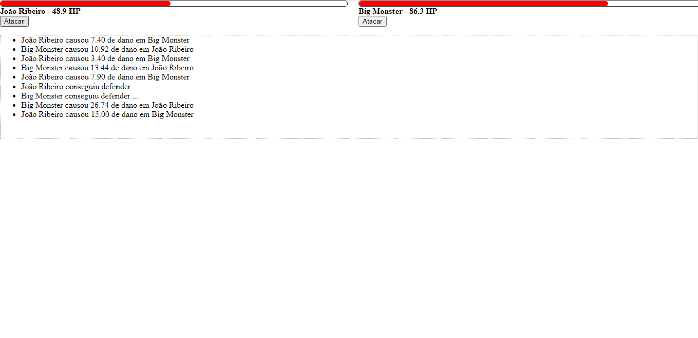
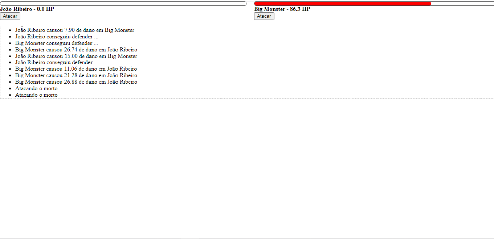

# 🛠 Tecnologias utilizadas:
 

  

  
   
  
  

 

# 💻  Sobre o Projeto:
<li>O Projeto Luta é uma página web que permite aos usuários realizarem uma luta entre um personagem contra o outro, com o uso de orientação a objetos.</li>
 

# ⚙️ Funcionalidades:
<li>Na primeira seção da página, os usuários serão apresentados a 2 personagem sendo eles o guerreiro e o mostro,que apresetaram uma barra de HP sendo ela a vida dos personagens e conforme o personagem toma dano a barra diminui.Logo abaixo deles a um botão para atacar.</li>
<li>Embaixo dos botão de atacar a um espaço indicando o que está acontecendo na luta(quanto de HP o personagem perdeu,se o personegem consegui defender o ataque, entre outros).</li>
<li>Caso o HP de algum dos personagem chegue a 0, aparecera uma mesagem que você está atacando um morto  </li>

# 🎨 Pré-visualização :
## Apresentação da Luta:

## Luta em andamento:

## Término da luta:

# 🦸 Autor:

 
<a href="https://www.linkedin.com/in/jo%C3%A3o-vitor-ribeiro-dias-339a56258/" target="_blank">João Vitor RIbeiro Dias</a>
